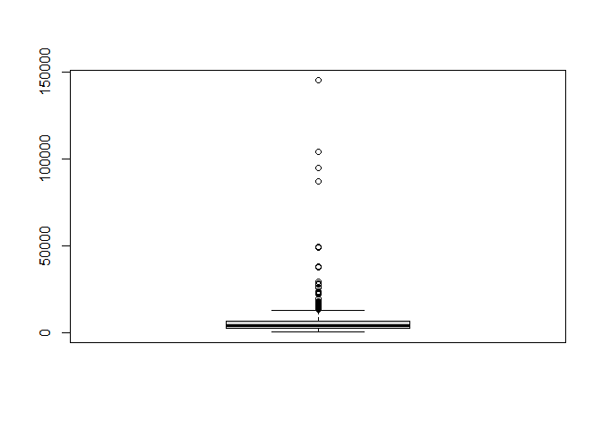

Reproduzindo Neto e Machado (2017)
================

## Introdução

O objetivo desse trabalho é reproduzir a análise feita por Neto e
Machado em “TRANSFERÊNCIAS CONDICIONAIS DE RENDA E NUTRIÇÃO: EFEITOS DO
BOLSA FAMÍLIA NAS ÁREAS RURAIS E URBANAS DO BRASIL”. Esse artigo é umas
das principais peças da bibliografia do meu TCC e, portanto, conseguir
reproduzir o trabalho dos autores trará para mim um ganho interessante
na curva de aprendizado em programação (com R), e também na manipulação
de grandes bases de dados (como a POF).

Os autores optaram por utilizar a POF de 2008/2009, enquanto eu optei
por utilizar a POF de 2017/2018, por ser a base escolhida para o meu
TCC.

## Importação dos dados

De maneira a simplificar o peso computacional, rodarei as análises
somente para o Estado do Acre.  
**Unidade de consumo = Família** (A unidade de consumo compreende um
único morador ou conjunto de moradores que compartilham da mesma fonte
de alimentação, isto é, utilizam um mesmo estoque de alimentos e/ou
realizam um conjunto de despesas alimentares comuns. Nos casos em que
não existia estoque de alimentos nem despesas alimentares comuns, a
identificação ocorreu através das despesas com moradia.)

**Variáveis utilizadas:**

  - Sub-amostras: 0 a 5 anos, 5 a 10 anos, 10 a 19 anos.

  - Área geográfica: Urbano e Rural.

  - Bolsa Famílias: Com e sem PBF (ver os critérios).

  - Variáveis regionais: As 5 grandes regiões do BR.

  - Variáveis do domicílio: Morador-Comodo, Infra-Domic,
    Infra-Vizinhança, Agua, Banheiros, Esgoto, Energia.

  - Variáveis da pessoa de referência: Idade, Anos-Estudo, Masculino,
    Branco, Formal, Horas-Trabalhadas

<!-- end list -->

``` r
library(magrittr)
library(dplyr)
```

    ## 
    ## Attaching package: 'dplyr'

    ## The following objects are masked from 'package:stats':
    ## 
    ##     filter, lag

    ## The following objects are masked from 'package:base':
    ## 
    ##     intersect, setdiff, setequal, union

``` r
setwd("C:/Arthur/TCC/TCC/RDS")
acre_or<- readRDS("OUTROS_RENDIMENTOS_ACRE.rds")

acre_or %>%
  #filter(V9001==5400101)%>%
  mutate(Codigo = trunc(V9001/100)) -> acre_or2

setwd("C:/Arthur/TCC/TCC/Microdados")
tradutor_rendimento <- readxl::read_excel("Tradutor_Rendimento.xls") 

tradutor_rendimento %>%
  mutate(Codigo = as.numeric(Codigo)) -> tradutor_rendimento
```

    ## Warning in mask$eval_all_mutate(dots[[i]]): NAs introduzidos por coerção

``` r
join <- left_join(acre_or2, tradutor_rendimento,by = "Codigo")
```

## Including Plots

You can also embed plots, for example:

<!-- -->

Note that the `echo = FALSE` parameter was added to the code chunk to
prevent printing of the R code that generated the plot.
